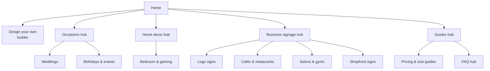

# The Glownique — SEO, AEO & GEO Audit and Improvement Guide

Sep 24, 2026 · @Zain Munir

## Summary: the 10 likely weak points

Ten weak points are most likely holding The Glownique back. Fix the two Critical ones first, because they decide whether AI chatbots can read the site at all.

The live site could not be crawled for this draft (browser extension offline, sandbox blocks the domain). Each point below comes from how Next.js neon-sign stores usually fail, and each has a quick check. Run the audit kit in the next section; any point that checks clean drops off the list.

| # | Likely weak point | Why it hurts | Quick check | Priority |
| --- | --- | --- | --- | --- |
| 1 | Key content rendered only in the browser (neon builder, product grid, prices) | Most AI crawlers do not run JavaScript, so they see a near-empty page | `curl` a product page and search for its name | Critical |
| 2 | AI crawlers blocked by robots.txt, Vercel Firewall or Cloudflare | Blocked bots cannot read or cite you in ChatGPT, Perplexity, Claude or Gemini | robots.txt plus firewall rules | Critical |
| 3 | Thin, templated product and category pages | Nothing unique to rank or quote; Google treats near-duplicates as low value | Unique words per page | High |
| 4 | No landing pages for use cases (weddings, cafés, salons, logo signs) | These are the exact queries buyers type and ask chatbots | Nav menu and sitemap | High |
| 5 | No plain-language answers on price, size, lifespan, shipping | AI answers pull from pages that state facts directly | Search the site for "how much" | High |
| 6 | Missing or partial schema (Product, Offer, Organization, Breadcrumb) | No rich results and weaker entity understanding | Google Rich Results Test | High |
| 7 | Few reviews and few off-site mentions | Chatbots recommend brands that other sites talk about | Search the brand in Google and Reddit | High |
| 8 | Bing Webmaster Tools not set up | ChatGPT search and Copilot rely on Bing's index | Is the site verified in Bing? | Medium |
| 9 | Heavy glow videos and hero images | Slow LCP and poor INP hurt rankings and sales | PageSpeed Insights, mobile | Medium |
| 10 | Duplicate hosts and URLs (www, \*.vercel.app, ?size= parameters) | Splits ranking signals and wastes crawl budget | Redirects and canonical tags | Medium |

## Audit kit: confirm the weak points in 15 minutes

Three checks tell you most of what a paid audit would: what a no-JavaScript bot sees, what the crawl controls say, and what each page's head contains. Paste the outputs back into chat and the summary table becomes real findings.

**Known so far:** custom LED neon and business signage, built on Next.js, hosted on Vercel, with GA4, Search Console and Microsoft Clarity planned.

**Open questions**

- [ ] Which market is the main target: Pakistan (Karachi, Lahore, Islamabad), international (US, UK, UAE), or both?
- [ ] Is there a physical workshop or showroom address customers can visit?
- [ ] Roughly how many product, category and blog pages exist today?
- [ ] Is the custom neon builder a client-side canvas, or server-rendered?

### Check 1: what AI crawlers see (terminal)

```bash
# Status code when a bot user agent asks (403/429 = firewall is blocking)
curl -s -o /dev/null -w "%{http_code}\n" -A "GPTBot/1.1" https://theglownique.com
curl -s -o /dev/null -w "%{http_code}\n" -A "ClaudeBot/1.0" https://theglownique.com

# Is real content in the raw HTML? Pick a phrase you can see on the page
curl -sL https://theglownique.com/<product-url> | grep -c "<phrase from the description>"

# Crawl controls
curl -s https://theglownique.com/robots.txt
curl -s https://theglownique.com/sitemap.xml | head -40
curl -sI https://theglownique.com/llms.txt | head -1

# One canonical host
curl -sI http://theglownique.com | grep -i location
curl -sI https://www.theglownique.com | grep -i location
curl -sI https://<project>.vercel.app | grep -iE "location|x-robots-tag"
```

A grep count of 0 means the text is injected by JavaScript, so weak point 1 is confirmed. A spoofed user agent can pass while real bots still fail, since firewalls verify bot IPs; Vercel's firewall logs are the final word.

### Check 2: what each page's head contains (browser console)

Open the homepage, one category and one product page. Paste this into DevTools > Console on each.

```js
(() => {
  const q = s => document.querySelector(s);
  const m = n => q(`meta[name="${n}"]`)?.content ?? q(`meta[property="${n}"]`)?.content ?? null;
  const schema = [...document.querySelectorAll('script[type="application/ld+json"]')].flatMap(s => {
    try { const j = JSON.parse(s.textContent); return [].concat(j['@graph'] ?? j).map(x => x['@type']); }
    catch { return ['INVALID JSON']; }
  });
  const imgs = [...document.images];
  return {
    url: location.href,
    title: document.title, titleLen: document.title.length,
    description: m('description'), descLen: (m('description') ?? '').length,
    canonical: q('link[rel="canonical"]')?.href ?? null,
    robots: m('robots'),
    lang: document.documentElement.lang || null,
    h1: [...document.querySelectorAll('h1')].map(h => h.innerText.trim()),
    h2Count: document.querySelectorAll('h2').length,
    words: document.body.innerText.split(/\s+/).length,
    ogImage: m('og:image'),
    schema,
    imgsMissingAlt: `${imgs.filter(i => !i.alt?.trim()).length} of ${imgs.length}`,
    internalLinks: [...document.links].filter(a => a.host === location.host).length,
  };
})()
```

### Check 3: free tools, in this order

1. [PageSpeed Insights](https://pagespeed.web.dev/), mobile tab, for homepage and one product page.
2. [Rich Results Test](https://search.google.com/test/rich-results) on a product page.
3. Search Console > URL Inspection > View crawled page, to see Google's rendered HTML.
4. `site:theglownique.com` in Google and Bing, to count indexed pages and spot junk URLs.

## Technical SEO

Server-render every page that should rank, and give Google one clean URL per page. On Next.js that is mostly configuration, not rewriting.

| Check | Pass looks like | Next.js / Vercel fix |
| --- | --- | --- |
| Rendering | Product names, prices, descriptions and FAQs appear in `curl` output | Fetch data in Server Components or `generateStaticParams`; keep `"use client"` only on interactive widgets |
| Neon builder | Builder page has server-rendered intro text, size and price table, FAQs | Wrap the canvas in a server page that carries the copy; lazy-load the canvas |
| robots.txt | Allows `/`, blocks only cart, checkout, account, API | `app/robots.ts` (below) |
| Sitemap | Lists every indexable URL with real `lastModified` | `app/sitemap.ts` generated from your product source |
| Canonical | Every page self-canonicals to `https://theglownique.com/...` | `metadataBase` in root layout + `alternates.canonical` per page |
| One host | http, www and \*.vercel.app all 308-redirect to one host | Vercel > Domains: set one primary, redirect the rest |
| Parameters | `?size=`, `?color=`, `?sort=` URLs canonical to the clean URL | Canonical in `generateMetadata`; do not link to filtered URLs in nav |
| Status codes | Deleted products return 404 or 301, never a 200 "not found" page | Call `notFound()` or `permanentRedirect()` in the page |
| Core Web Vitals (mobile) | LCP ≤ 2.5 s, INP ≤ 200 ms, CLS ≤ 0.1 | `next/image` with `priority` on hero only; poster image + `preload="none"` on glow videos; `next/font` |
| Images | WebP or AVIF, explicit width and height, descriptive file names | `next/image` handles format; rename files like `custom-neon-sign-wedding-pink.webp` |
| Language | `<html lang="en">` (plus `hreflang` only if you run separate country versions) | Set in root layout |
| Preview builds | Preview URLs not indexed | Vercel adds `noindex` to previews; confirm with the curl check |

### Drop-in files

```ts
// app/robots.ts
import type { MetadataRoute } from 'next'

export default function robots(): MetadataRoute.Robots {
  return {
    rules: [{ userAgent: '*', allow: '/', disallow: ['/api/', '/cart', '/checkout', '/account'] }],
    sitemap: 'https://theglownique.com/sitemap.xml',
    host: 'https://theglownique.com',
  }
}
```

```ts
// app/sitemap.ts
import type { MetadataRoute } from 'next'
import { getAllProducts, getAllCategories, getAllPosts } from '@/lib/catalog'

export default async function sitemap(): Promise<MetadataRoute.Sitemap> {
  const base = 'https://theglownique.com'
  const [products, categories, posts] = await Promise.all([getAllProducts(), getAllCategories(), getAllPosts()])
  return [
    { url: base, lastModified: new Date() },
    ...categories.map(c => ({ url: `${base}/${c.slug}`, lastModified: c.updatedAt })),
    ...products.map(p => ({ url: `${base}/products/${p.slug}`, lastModified: p.updatedAt })),
    ...posts.map(p => ({ url: `${base}/blog/${p.slug}`, lastModified: p.updatedAt })),
  ]
}
```

```ts
// app/layout.tsx (root) — then set alternates.canonical in each page's generateMetadata
export const metadata = {
  metadataBase: new URL('https://theglownique.com'),
  title: { default: 'The Glownique | Custom LED Neon Signs', template: '%s | The Glownique' },
}
```

The `title.template` stops the most common Next.js mistake: one identical title on every page, inherited from the root layout.

## On-page SEO

Every indexable page needs its own title, one H1 that matches the search, and 300+ words no other page has. Templated product pages with a shared description are the most common reason neon stores stall on page 3.

### Title and description formulas

| Page type | Title (50–60 chars) | Meta description (140–160 chars) |
| --- | --- | --- |
| Home | Custom LED Neon Signs & Business Signage \| The Glownique | What you make, who for, a proof point (reviews, delivery time), a call to action |
| Category | Neon Signs for Weddings — Custom Names & Quotes \| The Glownique | Styles offered, price-from, delivery window |
| Product | "Better Together" Neon Sign — Pink LED, 5 Sizes \| The Glownique | Size range, price-from, colour options, warranty |
| Builder | Design Your Own Neon Sign Online — Live Preview \| The Glownique | Fonts, colours, instant price, delivery time |
| Blog | How Much Does a Custom Neon Sign Cost? (2026 Guide) | The direct answer in one sentence |

### Product page template

Build each product page from these blocks, in this order. Each block is server-rendered text, not an image.

1. H1 with the product name plus the main keyword ("Custom Name Neon Sign").
2. Price-from, sizes, colours and delivery time above the fold.
3. A 2–3 sentence description unique to this product: where it fits, the mood, who buys it.
4. A spec table: dimensions per size, LED type, power (watts), backboard material, cable length, indoor or outdoor rating, warranty.
5. "Where it works" photos in real rooms and venues, with descriptive alt text.
6. Four to six FAQs specific to the product, visible on the page.
7. Reviews with photos, if you have them.
8. Links to three related products and the parent category.

### Headings, images, links

- **Headings:** one H1 per page, then H2s phrased as the questions buyers ask ("How big should a wedding neon sign be?").
- **Alt text:** describe the image and its context: "pink cursive 'Mr & Mrs' neon sign above a wedding head table", not "neon1.jpg".
- **Internal links:** home links to every category; each category links to its products and one guide; each guide links to two or three categories with descriptive anchor text.
- **Breadcrumbs:** Home > Wedding Neon Signs > Better Together, on every product page, marked up as schema (next section).
- **Business signage:** give it its own hub (logo signs, shopfront signs, office signs, menu boards). B2B buyers search differently from gift buyers.

## Structured data

Add five schema types: Organization, WebSite, Product with Offer, BreadcrumbList and FAQPage. Product with price, shipping and returns is the one that earns Google shopping features; the rest help Google and AI systems understand who you are.

| Schema | Where | What it earns |
| --- | --- | --- |
| Organization (or LocalBusiness if customers can visit) | Home, sitewide | Knowledge panel signals, logo, links your social profiles to the brand entity |
| WebSite | Home | Site name shown in results |
| Product + Offer | Every product page | Price, availability, shipping and return info in results; merchant listings |
| BreadcrumbList | Category and product pages | Breadcrumb trail instead of raw URL |
| FAQPage | FAQ hub, product FAQs | No FAQ rich result for most sites since 2023, but it labels Q&A clearly for machines |
| Review / AggregateRating | Product pages, only with real reviews shown on the page | Star ratings in results |

All markup must match what the page visibly shows. Replace every `<...>` placeholder with real values.

### Organization (root layout)

```json
{
  "@context": "https://schema.org",
  "@type": "Organization",
  "@id": "https://theglownique.com/#organization",
  "name": "The Glownique",
  "url": "https://theglownique.com",
  "logo": "https://theglownique.com/logo.png",
  "description": "Custom LED neon signs and business signage, designed and made to order.",
  "email": "<email>",
  "telephone": "<phone>",
  "sameAs": ["<instagram URL>", "<facebook URL>", "<tiktok URL>", "<pinterest URL>", "<google business profile URL>"]
}
```

### Product (each product page)

```json
{
  "@context": "https://schema.org",
  "@type": "Product",
  "name": "Better Together Neon Sign",
  "image": ["https://theglownique.com/images/better-together-neon-pink.webp"],
  "description": "<the unique description shown on the page>",
  "sku": "<sku>",
  "brand": { "@type": "Brand", "name": "The Glownique" },
  "offers": {
    "@type": "Offer",
    "url": "https://theglownique.com/products/better-together-neon-sign",
    "price": "<starting price>",
    "priceCurrency": "<PKR or USD>",
    "availability": "https://schema.org/MadeToOrder",
    "seller": { "@id": "https://theglownique.com/#organization" },
    "shippingDetails": {
      "@type": "OfferShippingDetails",
      "shippingRate": { "@type": "MonetaryAmount", "value": "<rate>", "currency": "<PKR or USD>" },
      "shippingDestination": { "@type": "DefinedRegion", "addressCountry": "<PK or US>" },
      "deliveryTime": {
        "@type": "ShippingDeliveryTime",
        "handlingTime": { "@type": "QuantitativeValue", "minValue": "<days>", "maxValue": "<days>", "unitCode": "DAY" },
        "transitTime": { "@type": "QuantitativeValue", "minValue": "<days>", "maxValue": "<days>", "unitCode": "DAY" }
      }
    },
    "hasMerchantReturnPolicy": {
      "@type": "MerchantReturnPolicy",
      "applicableCountry": "<PK or US>",
      "returnPolicyCategory": "https://schema.org/MerchantReturnNotPermitted"
    }
  }
}
```

`MerchantReturnNotPermitted` fits made-to-order signs; switch to `MerchantReturnFiniteReturnWindow` plus `merchantReturnDays` if you accept returns. For fixed designs sold in several sizes, use `ProductGroup` with `hasVariant`, one Product per size.

### Rendering it in Next.js

```tsx
<script
  type="application/ld+json"
  dangerouslySetInnerHTML={{ __html: JSON.stringify(jsonLd).replace(/</g, '\\u003c') }}
/>
```

Put this in the Server Component for the page so it ships in the raw HTML. Validate with the Rich Results Test and the Schema.org validator after each deploy.

## Trust, E-E-A-T and local SEO

Show that real people make these signs, and that real customers bought them. Google's quality raters and AI systems both weigh proof of experience, and a new custom-product site starts with almost none.

| Signal | What to publish | Why it matters |
| --- | --- | --- |
| About page | Who runs The Glownique, the workshop, how a sign is made, photos of the team at work | Answers "is this a real business?" for buyers and raters |
| Process page | Design proof → approval → production → quality check → packing, with timelines | Custom buyers fear the unknown; this page also gets quoted by AI |
| Policies | Shipping, warranty (months, what it covers), refunds for made-to-order items, payment methods | Required for Merchant Center and trusted by shoppers |
| Contact | Email, phone or WhatsApp, business hours, address if visitable | Same details everywhere (NAP consistency) |
| Reviews | Photo reviews on product pages; Google reviews on the Business Profile | Stars in results and the strongest AI recommendation signal |
| Portfolio | "Recent work" gallery tagged by use case and city | Unique images and proof of range |
| Author bios | Named author with a short bio on every guide | Experience signal on informational content |

### Google Business Profile

Create one if you have a workshop or showroom customers can visit, or register as a service-area business if you deliver without a storefront. Pick "Sign shop" as the primary category, add 20+ real photos, list products, and ask every happy customer for a Google review with a direct link. Keep the name, phone and address identical to the site footer and schema.

If the target market is Pakistan, local-intent queries ("neon sign shop Karachi") lean heavily on the map pack, so this profile matters more than any single page.

## AEO: answer engine optimization

Win featured snippets, People Also Ask boxes and voice answers by putting a direct 40–60 word answer right under each question heading. Answer engines lift the first clear sentence; a page that warms up for three paragraphs loses to one that answers in the first line.

### The answer-first pattern

1. H2 or H3 written as the exact question.
2. First sentence answers it with a number or a yes/no.
3. Next 1–2 sentences give the main condition or range.
4. Then detail: a table, a short list, or steps.

**Example block for the pricing guide:**

> **How much does a custom neon sign cost?** A custom LED neon sign from The Glownique costs `<price>` for a small 50 cm sign and `<price>` for a 120 cm sign. Price depends mainly on size, number of letters, colours and backboard shape. Use the builder for an instant quote.

Follow it with a size-by-price table. Tables and lists are the formats answer engines extract most cleanly.

### Questions to answer on the site

| Question buyers ask | Where to answer it |
| --- | --- |
| How much does a custom neon sign cost? | Pricing guide + builder page |
| What size neon sign do I need for a wall, a wedding, a shopfront? | Size guide with room photos |
| How long do LED neon signs last? | FAQ hub (state your rated hours and warranty) |
| Are LED neon signs safe? Do they get hot? | FAQ hub + product specs |
| Can LED neon signs be used outdoors? | Business signage hub |
| How much electricity does a neon sign use? | Spec table + FAQ |
| How long does a custom neon sign take to make and ship? | Process page + product pages |
| How do you hang or install a neon sign? | Installation guide with photos |
| LED neon vs glass neon: which is better? | Comparison guide |
| Can I turn my logo into a neon sign? | Business logo sign page |
| What font and colour work best for a wedding neon sign? | Wedding category + blog |
| Can I get a neon sign with a dimmer or remote? | Product specs + FAQ |

Mine more questions from Google's People Also Ask boxes, Search Console queries that start with how, what, can or are, and Reddit threads on r/weddingplanning and small-business subreddits.

### Rules that keep answers extractable

- One question per heading; never bury two answers in one paragraph.
- Use your own numbers (sizes in cm and inches, watts, days, warranty months), not vague words like "affordable".
- Keep FAQs visible on the page, not hidden behind JavaScript-only accordions that are empty in raw HTML.
- Update the year and figures in pricing content at least every six months.

## GEO: generative engine optimization

AI assistants recommend brands they can read and brands other sites vouch for. So GEO is two jobs: make the site machine-readable, then get The Glownique named on the pages AI systems already trust.

ChatGPT search and Copilot lean on Bing's index, Gemini and AI Overviews on Google's, and Perplexity on its own crawler plus others. Ranking well in plain Google and Bing search is still the foundation.

### Crawler access

| Bot (user agent) | Owner | What it does | Allow? |
| --- | --- | --- | --- |
| Googlebot | Google | Search, including AI Overviews and AI Mode | Yes |
| Google-Extended | Google | Controls use in Gemini models; no effect on Search ranking | Yes |
| Bingbot | Microsoft | Bing, Copilot, and results used by ChatGPT search | Yes |
| OAI-SearchBot | OpenAI | Pages shown in ChatGPT search answers | Yes |
| ChatGPT-User | OpenAI | Fetches a page when a user asks about it | Yes |
| GPTBot | OpenAI | Model training | Yes, for brand recall |
| ClaudeBot, Claude-SearchBot, Claude-User | Anthropic | Training, search, user fetches | Yes |
| PerplexityBot, Perplexity-User | Perplexity | Index and user fetches | Yes |
| Applebot-Extended | Apple | Apple Intelligence training | Yes |

A store wants to be recommended, so allow all of them. Then check the two places that silently block bots even when robots.txt allows them: Vercel Firewall (any bot or AI-bot rule set to Deny or Challenge) and Cloudflare, if DNS is proxied through it, since Cloudflare began blocking AI crawlers by default for new sites in 2025.

### Make pages easy for AI to read and quote

- **No JavaScript dependency.** AI crawlers mostly read raw HTML; server-render prices, specs and FAQs.
- **Fact-dense pages.** Sizes, prices, watts, lead times, warranty months in tables. Models quote specifics, not slogans.
- **Consistent entity.** Same name, one-line description, logo and contact details on the site, schema `sameAs`, Instagram, Facebook, Pinterest, TikTok and Google Business Profile.
- **Original data.** Publish something only you know: most popular sizes and colours from your orders, average lead time, a real pricing breakdown. Unique numbers get cited.
- **Comparison content.** "LED neon vs glass neon", "custom-made vs marketplace neon signs". Chatbots get asked "which is better" constantly.
- **Freshness.** Show a visible "Updated" date on guides and set `dateModified` in Article schema.

### Get into the sources AI trusts

- Roundups: pitch "best custom neon sign shops" and "wedding decor ideas" articles on wedding, interior and local business blogs.
- Reddit and forums: answer real questions as the brand, with disclosure, where rules allow it.
- YouTube and Instagram: time-lapse build videos and install guides; titles and descriptions get indexed.
- Directories: Bing Places, Apple Business Connect, local business directories in your target cities.
- Feeds: Google Merchant Center free listings put products into Shopping and AI Mode shopping results. OpenAI also runs a merchant product-feed program for ChatGPT shopping; check whether your market is eligible.

### Bing and IndexNow

Verify the site in Bing Webmaster Tools (import from Search Console), submit the sitemap, and add IndexNow so Bing learns about new or changed URLs within minutes. On Vercel, IndexNow is a key file in `/public` plus a POST to `api.indexnow.org` after each content publish.

### llms.txt (optional, low effort)

`llms.txt` is a proposed Markdown index of your key pages for AI tools. No major AI provider has confirmed using it, so treat it as a 20-minute extra, not a ranking lever.

```markdown
# The Glownique
> Custom LED neon signs and business signage, designed online and made to order. Ships to <regions>.

## Shop
- [Design your own neon sign](https://theglownique.com/builder): live preview and instant price
- [Wedding neon signs](https://theglownique.com/wedding-neon-signs)
- [Business logo signs](https://theglownique.com/business-signs)

## Guides
- [How much does a custom neon sign cost?](https://theglownique.com/blog/neon-sign-cost)
- [Size guide](https://theglownique.com/size-guide)

## Policies
- [Shipping](https://theglownique.com/shipping) · [Warranty](https://theglownique.com/warranty) · [FAQ](https://theglownique.com/faq)
```

The URLs are examples; match them to your real routes.

## Keyword and content strategy

Build one landing page per buyer intent (occasion, room, business type) and one guide per common question, all linked from four hubs. Generic "custom neon signs" is dominated by large brands; the long tail is where a new site wins first.

Search volumes were not pulled for this draft. Validate each cluster in Google Keyword Planner or Search Console before writing. If the target market is Pakistan, add city and country modifiers (Karachi, Lahore, Islamabad, "price in Pakistan") to each cluster.

### Keyword clusters

| Cluster | Example queries | Page to build | Intent |
| --- | --- | --- | --- |
| Core | custom neon signs, custom LED neon sign, design your own neon sign | Home + builder | Buy |
| Weddings | wedding neon sign, "better together" neon sign, neon name sign for wedding | Wedding category | Buy |
| Events | birthday neon sign, baby shower neon sign, party neon backdrop | Events category | Buy |
| Home and rooms | bedroom neon sign, gaming room neon sign, neon wall art | Home decor category | Buy |
| Business logo | logo neon sign, neon sign for business, custom business sign | Business hub + logo page | Buy (B2B) |
| Venues | café neon sign, restaurant neon sign, salon neon sign, gym neon sign | One page per venue type | Buy (B2B) |
| Shopfront | outdoor LED sign, shopfront signage, 3D acrylic letters | Signage page | Buy (B2B) |
| Price | how much does a neon sign cost, neon sign price | Pricing guide | Research → buy |
| Specs | LED neon vs glass neon, do LED neon signs get hot, neon sign power usage | Guides + FAQ hub | Research |
| Ideas | neon sign ideas for bedroom, neon sign quotes, wedding neon sign ideas | Idea galleries | Inspire |

### Site architecture



Every product sits under one hub and links back to it; every guide links forward to two or three buying pages.

### First 12 guides to publish

1. How much does a custom neon sign cost? (with your real price table)
2. Neon sign size guide: what size for a wall, wedding or shopfront?
3. LED neon vs glass neon: cost, safety, lifespan
4. How long do LED neon signs last?
5. How to hang a neon sign without damaging the wall
6. Wedding neon sign ideas (gallery of real orders)
7. Best fonts and colours for neon signs
8. How to turn your logo into a neon sign: file types, sizes, pricing
9. Neon signs for cafés and restaurants: ideas and ROI
10. Are LED neon signs safe for kids' rooms?
11. Indoor vs outdoor LED neon signs
12. How we make a custom neon sign (process, with photos and video)

Publish one to two a week. Quality beats count: each needs real photos, your own numbers and a direct answer in the first 60 words.

## Off-page: links and mentions

A new domain needs other sites pointing at it before Google or a chatbot will trust it. Aim for 5–10 relevant links and mentions a month from real businesses, not bulk link packages, which risk a manual penalty.

| Tactic | How | Effort | Payoff |
| --- | --- | --- | --- |
| Customer showcases | Ask cafés, salons and event planners who bought a sign to credit "Sign by The Glownique" with a link or tag | Low | Local links + social proof |
| Wedding and event vendors | Partner with planners, decorators and venues; offer a referral rate for a listing on their vendor page | Medium | Links from the exact niche |
| Roundup pitches | Email authors of "best neon sign shops" and "wedding decor ideas" posts with photos and a one-line offer | Medium | Direct AI-citation sources |
| Digital PR with your data | Publish "most popular neon sign colours and phrases" from your orders; pitch to lifestyle and local news sites | Medium | High-authority links |
| Directories | Google Business Profile, Bing Places, Apple Business Connect, local business listings | Low | NAP consistency + map pack |
| Social profiles | Instagram, TikTok, Pinterest, Facebook, YouTube with the same name and a site link | Low | Entity signals + discovery |
| Reddit and Q&A | Helpful answers on decor and small-business threads, brand disclosed | Low, ongoing | Mentions AI systems read |
| Influencer seeding | Gift signs to home-decor and wedding creators in the target market | Medium | Mentions, content, links |

Track new referring domains monthly in Search Console > Links and Bing Webmaster Tools > Backlinks. Disavow only if you see an obvious spam attack.

## 30/60/90-day action plan

Fix access and rendering in month one, build pages in month two, earn mentions in month three. Most ranking gains show 2–4 months after the work, so the order matters more than speed.

### Days 1–30: foundations (by Oct 24, 2026)

- [ ] Run the audit kit and paste results back for real findings
- [ ] Confirm no AI bots are blocked in robots.txt, Vercel Firewall or Cloudflare
- [ ] Move product, price and FAQ content into server-rendered HTML
- [ ] Add `app/robots.ts`, `app/sitemap.ts`, `metadataBase` and a title template
- [ ] Redirect www, http and \*.vercel.app to one host; add canonicals
- [ ] Unique title and meta description on every page
- [ ] Organization, WebSite, Product, Breadcrumb schema; pass the Rich Results Test
- [ ] Verify Search Console and Bing Webmaster Tools; submit sitemaps; add IndexNow
- [ ] Create Google Business Profile; set up GA4 AI-referral channel (next section)
- [ ] Fix mobile LCP and INP on home and top product pages

### Days 31–60: content (by Nov 23, 2026)

- [ ] Rewrite top 10 product pages with the product page template
- [ ] Launch four hubs: Occasions, Home decor, Business signage, Guides
- [ ] Publish the pricing guide, size guide and FAQ hub (answer-first)
- [ ] Publish About, Process, Shipping, Warranty and Returns pages
- [ ] Add photo reviews to product pages; start the Google review request flow
- [ ] Set up Google Merchant Center free listings
- [ ] Publish guides 4–8 from the content plan

### Days 61–90: authority (by Dec 23, 2026)

- [ ] Pitch 20 roundup and vendor sites; aim for 10 links or mentions
- [ ] Publish one original-data piece from your order history
- [ ] Launch venue pages (cafés, salons, restaurants, gyms) and a logo sign page
- [ ] Publish guides 9–12; refresh pricing guide figures
- [ ] Run the first monthly AI prompt panel and compare with the baseline
- [ ] Review Search Console: expand pages ranking 8–20 with more depth and links

## Measurement

Track three things monthly: Google and Bing search performance, visits from AI assistants, and whether chatbots name The Glownique when asked. Record a baseline before the first fixes ship so every later number has a comparison.

| KPI | Tool | Where to look |
| --- | --- | --- |
| Indexed pages vs sitemap URLs | Search Console | Pages report |
| Impressions, clicks, average position by page | Search Console, Bing Webmaster Tools | Performance |
| Non-brand clicks | Search Console | Queries, filter out "glownique" |
| Core Web Vitals pass rate (mobile) | Search Console | Core Web Vitals report |
| Rich result coverage | Search Console | Enhancements (Product, Breadcrumb) |
| AI assistant sessions and conversions | GA4 | Custom channel group below |
| Brand mentions in AI answers | Manual prompt panel | Monthly sheet |
| Referring domains | Search Console, Bing | Links report |
| Google reviews count and rating | Business Profile | Reviews |

### GA4: an "AI assistants" channel

Admin > Data display > Channel groups > create a copy of the default group. Add a channel named AI assistants, place it above Referral, with source matching this regex:

```text
chatgpt\.com|chat\.openai\.com|perplexity\.ai|gemini\.google\.com|copilot\.microsoft\.com|claude\.ai|chat\.deepseek\.com
```

Google AI Overviews and AI Mode clicks arrive as normal Google organic traffic, so they show up in Search Console, not in this channel.

### Monthly AI prompt panel

Ask the same 15–20 prompts in ChatGPT, Perplexity, Gemini, Google AI Mode, Copilot and Claude each month. Log whether The Glownique is mentioned, linked, and which competitors appear. Example prompts:

- Best place to order a custom neon sign `<in city/country>`
- Custom neon sign for a wedding: who makes good ones?
- How much does a custom LED neon sign cost?
- Where can I get my business logo made into a neon sign?
- Is The Glownique legit?

The last prompt shows what AI systems currently believe about the brand; fix whatever they get wrong at the source page.

## References

These official pages back the guidance above. They were not opened for this draft, so confirm the details before relying on them.

- [Google: structured data search gallery](https://developers.google.com/search/docs/appearance/structured-data/search-gallery)
- [Google: AI features and your website](https://developers.google.com/search/docs/appearance/ai-features)
- [Next.js: generateMetadata reference](https://nextjs.org/docs/app/api-reference/functions/generate-metadata)
- [OpenAI: crawlers and user agents](https://platform.openai.com/docs/bots)
- [llms.txt proposal](https://llmstxt.org/)
- [IndexNow](https://www.indexnow.org/)
